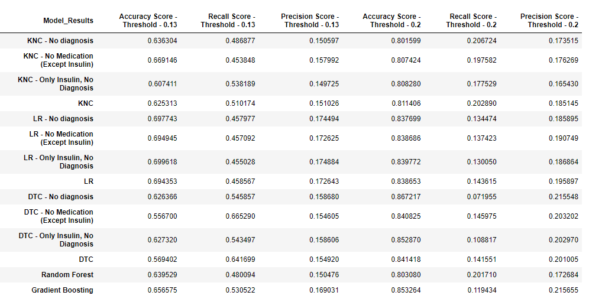
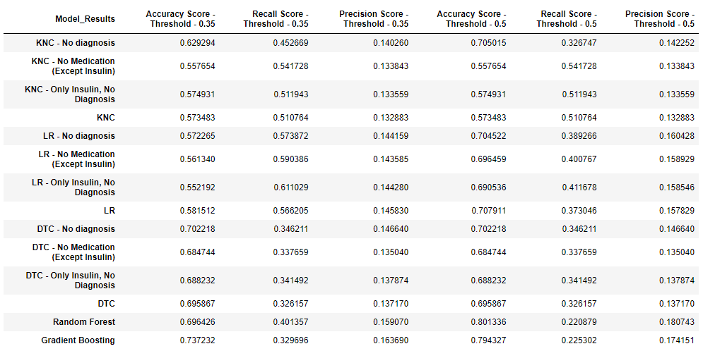

[Jupyter Notebook without oversampling](artificial-intelligence-capstone-diabetic-patient-readmission.ipynb)

[Jupyter Notebook with oversampling](artificial-intelligence-capstone-diabetic-patient-readmission-oversampling.ipynb)

<B><H1>Capstone project </H1></B>
Professional Certificate in Machine Learning and Artificial Intelligence - May 2023 offered via emeritus.org
<B><H1>Business Objective</H1></B>
Identify the probability that a diabetic patient will be readmitted with in less than 30 days after discharge from hospital
<B><H2>About Data</H2></B>

    <ul>
        <li><a href="https://www.w3schools.com">Diabetic patients readmission for 1999 – 2008</a> available at UC Irvine Machine Learning Repository</li>
        <li>10 years, from 1999 to 2008, of clinical data of inpatient </li>
        <li>Collected for 130 US hospitals and integrated delivery networks  </li>
        <li>Data of patients 
            <ul>
                <li>Diagnosed with diabetes</li>
                <li>Underwent laboratory test</li>
                <li>Took medications during their stay</li>
                <li>Stayed up to 14 days</li>
            </ul>
        </li>
        <li> Sample size: 101766
            <ul> 
                <li>Features: 47 such as admission and discharge type, length of stay, diagnosis, lab tests and medication</li>
                <li>Features: 47 such as demographics, admission and discharge type, length of stay, diagnosis, lab tests and medication</li>
                <li>Has both Numerical and Categorical data</li>
                <li>Data does not contain null values but we have unknown/invalid and ? values</li>
            </ul>
        </li>
    </ul>

    <B><H2>Data Analysis and Preparation</H2></B>
    <ul>
        <li><B>Features that will not have any data modifications or cleaning</B>
            <ul>
                <li>Medication Change (change)
                  <ul>
                    <li>54% no change in medication</li>
                    <li>46% change in medication</li>
                  </ul>
                </li>
                <li>Diabetic medication prescribed (diabetesMed)
                  <ul>
                    <li>23% not prescribed to diabetic medication</li>
                    <li>77% prescribed to diabetic medication</li>
                  </ul>
                </li>
                <li>Number of Days between Admission and Discharge (time_in_hospital)
                  <ul>
                    <li>Data is for patients in the hospital up to 14 days</li>
                    <li>3 days is highest closely followed by 2 day. After 3 days, the numbers dropped   </li>
                    <li>Only 10% of the data for 8 day or more</li>
                  </ul>
                </li>
                <li>Number of non lab procedures (num_procedures)
                  <ul>
                    <li>0 to 6 procedures</li>
                    <li>20% have 1 and the other 4 are between 5% to 13%</li>
                  </ul>
                </li>
            </ul>
        </li>
        <li><B>Features that will be dropped</B>
            <ul>
                <li>Encounter Id(encounter_id)      : This is just ID value</li>
                <li>Unique Patient Id(patient_nbr)  : We are modeling based on encounter and not based on individual patient</li>
                <li>Patient Weight (weight)
                  <ul>
                    <li>97% values are ? meaning its not available or not recorded</li>
                    <li>Thus decided not to use</li>
                  </ul>
                <li>Secondary diagnosis codes (diag_2, diag_3)
                  <ul>
                    <li>First 3 digits of secondary diagnosis ICD9 codes</li>
                    <li>diag_2 have 923 unique values</li>
                    <li>diag_3 have 954 unique values</li>
                    <li>Because of the number of unique values decided to drop</li>
                    <li>Also primary diagnose code is also available</li>
                  </ul>
                <li>Admitting Physician specialty (medical_specialty)
                  <ul>
                    <li>72 Unique values</li>
                    <li>50% is ? (looks like ? is used for null)</li>
                    <li>4 values are almost 35%</li>
                    <li>Considered to shrink to the top few values and all renaming set to other</li>
                    <li>Because of the % of missing data, decided to drop</li>
                  </ul>
                <li>Max Glucose Serum Test results (max_glu_serum)
                  <ul>
                    <li>Not available for 95% </li>
                    <li>Because of the % of missing data, decided to drop</li>
                  </ul>
              <li>Unique 23 Payer Codes (payer_code)
                  <ul>
                    <li>Not available for 95% </li>
                    <li>40% missing data</li>
                    <li>30% is of one provider code MC (Probably Medicare)</li>
                    <li>Because of missing data and only one other code used so much, decided to dropped the feature</li>
                  </ul>
              </li>
                <li>Patient admission info (admission_source_id)
                    <ul>
                        <li>26% Physician Referral</li>
                        <li>50% Emergency</li>
                        <li>Updated to have 3 different values - Emergency, Physician referral, Other</li>
				        <li>Dropped as it seemed to closely correlated to Type of Admission</li>
                    </ul>
                 </li>
            </ul>
        </li>
        <li><B>Drop outlier patient records</B>
            <ul>
                <li>Admission Type Id(admission_type_id) 
                  <ul>
                      <li>8 different values </li>
                      <li>4 - Newborn, there are only 10 records, we will drop this from the data set for modeling </li>
                      <li>7 - Trauma Center, there are only 21 records, we will drop this from the data set for modeling </li>
                      <li>5 - Not Available, 6 - NULL, 8 - Not Mapped: Indicates value are not available </li>
                      <li>The above 3 are close to 10%, so we cannot simply drop them </li>
                      <li>With dropping and re-categorizing, we will have 4 values for this feature</li>
                  </ul>
                </li>
                <li>Number of diagnoses(number_diagnoses): Drop patient records with 1 or above 9 number of diagnoses
                    <ul>
                        <li>50% of patients have 9 Diagnoses entered in to the system</li>
				        <li>Number of Diagnoses below 2 and above 9 looks outliers and these records are dropped</li>
                    </ul>
                </li>
                <li>Number of Lab procedures (num_lab_procedures)
                    <ul>
                        <li>Patients have at least 1 procedure done</li>
                        <li>Most patients seems to have got around 45 lab procedures</li>
                        <li>Procedures over 98 seems outliers and those records will be dropped</li>
                    </ul>
                </li>
                <li>Patient Gender (gender)
                    <ul>
                         <li>54% are Female</li>
                         <li>46% are Male</li>
                        <li>Only 3 records with Unknown/Invalid value for gender and thus dropped</li>
                    </ul>
                </li>
                <li>Patient Age (age)
                    <ul>
                        <li>Not an exact age but range of 10 year</li>
                        <li>Close to 85% are above 50 years</li>
                        <li>40 and below are close to 5%</li>
                        <li>0 to 40 years is grouped as 30 to 40</li>
                        <li>Will be converted to Numerical values from 40 to 100</li>
                    </ul>
                </li>
            </ul>
        </li>
        <li><B>Feature Value Changes</B>
            <ul>
               <li>A1Cresult
                   <ul>
                        <li>84% is none - meaning the test values is not available or its not taken</li>
                        <li>Other 3 are >8, >7 and Normal</li>
                        <li>Changes this to boolean if test taken or not</li>
                    </ul>
               </li>
                <li>Patient Race (race)
                    <ul>
                        <li>75% Caucasian</li>
                        <li>19% African American</li>
                        <li>2.2% Not available, 1.5% Other 0.6% Asian, 2% Hispanic - All these are changed to Other</li>
                    </ul>
                </li>
                <li>Number of medications administered (num_medications)
                    <ul>
                        <li>Most patients had 20 to 30 medications</li>
				        <li>IQR indicates over 35 medications might be outliers</li>
                        <li>Patients with more than 40 medications are updated to 40 medications</li>
                    </ul>
                </li>
                 <li>Patient discharge info (discharge_disposition_id)
                     <ul>
                         <li>29 different values</li>
                         <li>Feature compressed to 4 different values - Home, Expired, Referred, Other</li>
                     </ul>
                 </li>
                 <li>Number of Outpatient visits in last 1 year (number_outpatient): Changing from number to visited or not
                    <ul>
                        <li>84% not visited</li>
                        <li>Changed from number to Outpatient visited or not</li>
                     </ul>
                 </li>
                 <li>Number of Inpatient visits in last 1 year (number_inpatient)
                     <ul>
                        <li>66.5% not visited</li>
                        <li>Changed from number to inpatient visited or
 not</li>
                     </ul>
                 </li>
                 <li>Number of Emergency visits in last 1 year (number_emergency)
                        <ul>
                        <li>89% not visited</li>
                        <li>Changed from number to inpatient visited or not</li>
                     </ul>
                 </li>
                  <li>Medications: 23 medication features are updated to either used or not
                      <ul>
                          <li>23 medication features indicating if they are used or not</li>
                          <li>2 medications not used at all - these two features are dropped</li>
                          <li>Some medications are used less 100 patients - these features also dropped</li>
                          <li>10 medication features remained</li>
                      </ul>
                 </li>
                  <li>Primary diagnosis
                      <ul>
                          <li>Total of 848 values</li>
                          <li>Using the 3 digit ICD9 code, created a new feature with 17 different values</li>
                          <li>CIRCULATORY from the new feature is 30%</li>
                          <li>Categories less than 4% are changed to others</li>
                          <li>With the updates, this new features has 11 values </li>
                          <li>Some medications are used less 100 patients - these features also dropped</li>
                          <li>10 medication features remained</li>
                          <li>https://en.wikipedia.org/wiki/List_of_ICD-9_codes</li>
                      </ul>
                 </li>
            </ul>
        </li>
        <li><B>Classification Feature</B>
             <ul>
                 <li>Readmitted: Changed to 1 for readmitted in less than 30 days, otherwise 0</li>
            </ul>
        </li>
    </ul>

<B><H2>Modeling</H2></B>
<ul>
	<li>One hot encoder is used for categorical features.</li>
	<li>StandardScaler used for scaling the data</li>
	<li>GridSearchCV is used to identify the best estimator based on accuracy for each classifier</li>
	<li>KNeighborsClassifier, LogisticRegression and DecisionTreeClassifier are used for modeling.</li>
	<li>4 patterns of data was used for modeling using medication and primary diagnostic code
		<ul>
			<li>All medication data and primary diagnosis code was included</li>
			<li>Primary diagnosis code was not included</li>
			<li>Non Insulin medication data was not used</li>
			<li>Primary diagnosis and Non Insulin medication was not included</li>
		</ul>
	</li>
	<li>KNeighborsClassifier hyper parameters
	  <ul>
	 	<li>n_neighbors: 1 to 100 in increments of 1</li>
		<li>weights: distance, uniform</li>
 	  </ul>
	</li>
	<li>LogisticRegression hyper parameters
	  <ul>
	 	<li>max_iter: 500 to 1000 in increments of 50; 400 to 800 in increments of 50 with oversampled modelling</li>
		<li>class_weight: None, 'balanced'</li>
 	  </ul>
	</li>
	<li>DecisionTreeClassifier hyper parameters
	  <ul>
	 	<li>max depth: 5 to 100 in increments of 5; not used with Oversampled modelling</li>
		<li>min samples split: 2, 4, 6 </li>
		<li>criterion: gini, entropy, log_loss</li>
		<li>min samples leaf: 2, 4, 6</li>
		<li>random state: 15, 20, 42</li>
		<li>splitter: 'best','random'</li>
 	  </ul>
	</li>
	<li>Additional hyper parameters are also used with GridSearch for model evaluation, but decided to use listed above </li>
	<li>Same model evaluations  were also done by Oversampling using SMOTENC </li>
</ul>

<B><H2>Observations</H2></B>
    <ul>
<li><B>Technical without Oversamling</B>
            <ul>
		<li><a href="artificial-intelligence-capstone-diabetic-patient-readmission.ipynb">Jupiter Notebook</a></li>		
		    <li>KNeighborsClassifier, LogisticRegression and DecisionTreeClassifier are used for modeling.</li>
				<li>4 patterns of data was used for modeling using medication and primary diagnostic code
					<ul>
						<li>All medication data and primary diagnosis code was included</li>
						<li>Primary diagnosis code was not included</li>
						<li>Non Insulin medication data was not used</li>
						<li>Primary diagnosis and Non Insulin medication was not included</li>
					</ul>
				</li>
				<li>Non of the Modules were able to predict a patient would be able to readmit with the probability of 50% or greater</li>
				<li>They did reasonably OK at the probability of 13% and above</li>
				<li>All models have very less Precision score</li>
				<li> At 13% Probability threshold
					<ul>
						<li>Accuracy is around 60% to 70% </li>
						<li>Recall is around 45% to 65% </li>
						<li>Precision is around 15% to 17% </li>
                        <li>DecisionTreeClassifier with our Diagnosis performed better than others</li>
                    </ul>
				</li>
				<li> At 20% Probability threshold
					<ul>
						<li>Accuracy is around 80% to 85% </li>
						<li>Recall is around 15% to 20% </li>
						<li>Precision is around 15% to 17% </li>
                        <li>DecisionTreeClassifier witt all medications and diagnosis better than others</li>
					</ul>
				</li>
		    <li></li>
            </ul>
        </li>
	    <li><B>Technical with Oversampling</B>
            <ul>
		<li><a href="artificial-intelligence-capstone-diabetic-patient-readmission-oversampling.ipynb">Jupiter Notebook</a></li>		
		    <li>KNeighborsClassifier, LogisticRegression and DecisionTreeClassifier are used for modeling.</li>
		    		<li>SMOTENC at random state 24 used for oversamplling</li>
				<li>4 patterns of data was used for modeling using medication and primary diagnostic code
					<ul>
						<li>All medication data and primary diagnosis code was included</li>
						<li>Primary diagnosis code was not included</li>
						<li>Non Insulin medication data was not used</li>
						<li>Primary diagnosis and Non Insulin medication was not included</li>
					</ul>
				</li>
				<li> At 35% Probability threshold
					<ul>
						<li>Accuracy is around 55% to 70% </li>
						<li>Recall is around 35% to 60% </li>
						<li>Precision is around 13% to 14% </li>
                        <li> LogisticRegression when not including non-insulan medications and Diagnosis performed better
                    </ul>
				</li>
				<li> At 50% Probability threshold
					<ul>
						<li>Accuracy is around 55% to 70% </li>
						<li>Recall is around 30% to 55% </li>
						<li>Precision is around 13% to 14% </li>
                        <li> LogisticRegression when not including non-insulan medications and Diagnosis performed better
					</ul>
				</li>
		    <li></li>
            </ul>
        </li>
        <li><B>Business </B>
            <ul>
				<li>ROI is an important factor for business</li>
				<li>ROI could be determined as
					<ul>
						<li>The cost of individual intervention</li>
						<li>The cost and non cost benefits on helping a patient not needing to readmit again in less than 30 days</li>
                        <li>The success rate of the intervention program</li>
                        <li>A non financial ROI such as improving a business image</li>
                    </ul>
                </li>
                <li>Looking the above ROI impact components 
                    <ul>
                        <li>A low intervention cost
                            <ul>
                                <li>Could enable business use a low probability threshold</li>
                                <li>There by helping more patients avoid readmission even at the additional cost of unnecessary interventions</li>
                            </ul>
                        </li>
                        <li>A high intervention cost
                            <ul>
                                <li>Could enable business use a high probability threshold</li>
                                <li>This means they are helping less patients</li>
                                <li>But if an insurance company can take steps and help even small number of patients, it could still be huge cost saving for them.
                            </ul>
                        </li>
                        <li>Bottom line
                            <ul>
                                <li>The cost of intervention and its success rate will be deciding factors</li>
                                <li>A threshold and the data pattern can be decided which would maximize the business financial and non financial ROI</li>
                                <li> This is a limited data we used for modeling, an good ROI when using models with limited data could encourage business invest more in gathering more data in pursuit of better ROI.</li>
                            </ul>
                        </li>
                    </ul>
                </li>
            </ul>
        </li>
    </ul>

   
